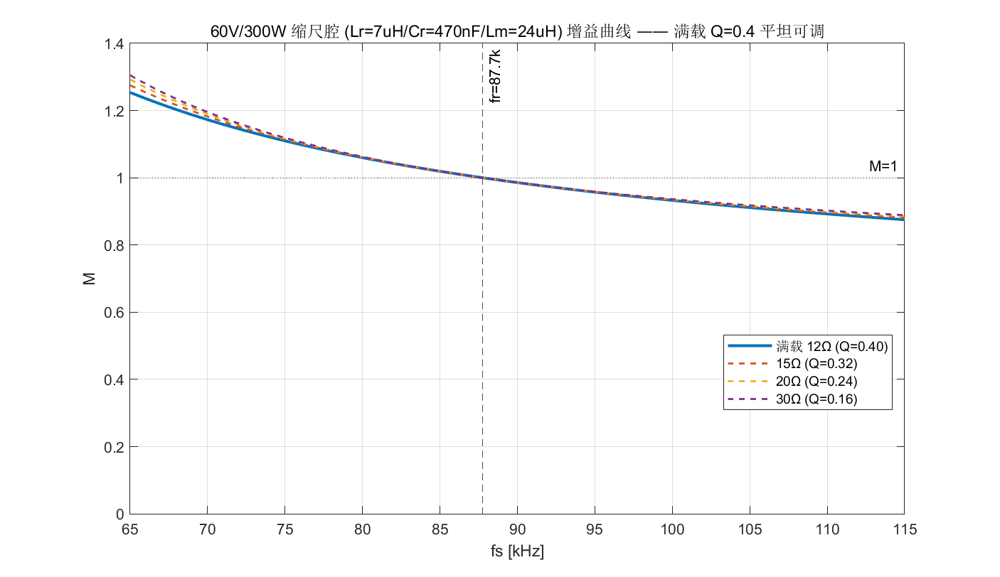

# 60V/300W 缩尺设计（1kW → 60V 300W）

> **本目录对应"1kW 缩尺成 60V/300W"这一开发阶段。**
> 核心：现谐振腔按 400V/1kW 设计，**60V 下跑不出瓦级功率**，必须单独设计一个
> **60V/300W 专用谐振腔**（换新变压器），才能在 60V/300W 电源上做真实功率验证。
> 本文档是这套缩尺设计的完整说明（原 MATLAB 仿真图只有图、没有文档，这是补上的说明）。

> **⚠️ 2026-08-13 实际器件更新（2026-08-19 修正 Lr/fr）**：谐振腔已按实际到手器件落地 ——
> **Lr=8.2µH、Cr=470nF**（原方案此处为 Lr=7µH）。新变压器按实际器件绕制：
> **1:1、6T、Lm=26µH、气隙 0.32mm**，权威规格见
> **[`PQ3535变压器绕制设计.md`](./PQ3535变压器绕制设计.md)**（含时域仿真验证，
> 励磁比 k=3.2 经"1:1 稳压 + 绕制难易"核对确认）。实测 **fr≈75kHz**（增益=1，
> 2026-08-18）。下文 §3-§7 为原方案设计值，仅作原理参考。

> **✅ 2026-08-18 实测定论：压降根因已定位**：**副边整流前方波增益健康**（fr≈75kHz
> 增益=1，80kHz 满摆 60V）——**不是谐振腔、不是设计、不是器件异常**。唯一压降来源是
> 整流管 **RHRP860 的 VF**（两只串 ~2-3V，1kW 高压设计的管子不能直接搬给 60V 缩尺）。
> 修复：换 **MBR10100** 肖特基（验证点 60V/80kHz/40Ω → ~57-58V）。详见 §11。

---

## 1. 背景与问题：为什么 60V 需要专用谐振腔

现谐振腔按额定 **400V/1kW** 设计（`Z0=181.5Ω`，设计书 §3.2 满载 Q=0.35）。把它接到
60V 电源上，负载电阻按**功率守恒**折算后品质因数会非常高：

| 目标功率 | 60V 下负载电阻 | Q（物理口径，R_ac=0.8106·R） |
|---|---|---|
| 300W | 12Ω | 18.7 |
| 120W | 30Ω | 7.5 |
| 46Ω 实测电阻 | 46Ω | 4.9 |

高 Q 下 LLC 增益曲线**封顶 M≈1.0 且没有升压区**，实测 60V/46Ω 增益被卡在 **M≈0.8**
（100k→43.49V、105k→47.8V、115k→36.92V，见 `llc_sim.m`）——**60V 根本跑不出真实功率**。
结论：要用 60V/300W 电源跑瓦级功率，必须**单独设计一个 60V 谐振腔**。

---

## 2. 设计目标

- 输入 **60V**（300W 可调电源），输出目标 **60V**（M=1）
- 满载 **300W**，可逐级降压验证（功率阶梯）
- 增益曲线**平坦、有升压余量、扫频不塌**，软启动平滑、闭环留有余量

---

## 3. 谐振腔参数设计

设计目标是让满载 300W 落在**低 Q 平坦区**，避开现腔的高 Q 封顶问题。

### 3.1 满载等效电阻与目标 Q

满载 12Ω 输出，折算到原边（1:1 全绕组，n=1）：

$$R_{ac} = \frac{8}{\pi^2} R_{load} = \frac{8}{\pi^2}\times 12Ω = 9.73Ω$$

LLC 设计经验：满载 Q 取 **0.3~0.5** 兼顾增益范围与带载能力 → 取 **Q≈0.40**。

### 3.2 由 Q 推特性阻抗 Z0

$$Z_0 = Q \cdot R_{ac} = 0.40 \times 9.73Ω ≈ 3.86Ω$$

### 3.3 选谐振频率 fr 与 Lr / Cr

取 **fr ≈ 87.7kHz**（与现腔 107kHz 同量级，频率控制带宽/软启动节奏可沿用）：

$$L_r = \frac{Z_0}{2\pi f_r} = \frac{3.86}{2\pi\times87.7k} ≈ 7.0µH$$

$$C_r = \frac{1}{Z_0\cdot 2\pi f_r} ≈ 470nF$$

### 3.4 励磁电感 Lm（决定励磁比）

取励磁比 h = Lm/Lr ≈ **3.43**（λ = Lr/Lm ≈ 0.29，增益曲线平缓有裕量）：

$$L_m = h \cdot L_r = 3.43 \times 7µH ≈ 24µH$$

### 3.5 参数汇总（与 `llc_rescale.m` 一致）

| 参数 | 值 | 说明 |
|---|---|---|
| **Lr** | **7µH** | 谐振电感 |
| **Cr** | **470nF** | 谐振电容（CBB 类，耐压按谐振电流选） |
| **Lm** | **24µH** | 新变压器励磁电感 |
| fr | ≈ 87.7kHz | 1/(2π√(Lr·Cr)) |
| Z0 | ≈ 3.86Ω | √(Lr/Cr) |
| λ = Lr/Lm | ≈ 0.29 | h = Lm/Lr ≈ 3.43 |
| 满载 Q | ≈ 0.40 | 12Ω 满载，R_ac=9.73Ω |

---

## 4. 新变压器要求（必须换）

**旧变压器不可用**：现 PQ35 原边 Lm=2mH，本设计需要 **Lm≈24µH，相差约 80 倍**，
旧变压器励磁电感太大，无法工作。

新变压器要求：
- **匝比 1:1**（原边 : 副边全绕组 = 1:1，中心抽头分两个半绕组，跨全输出）
- **励磁电感 Lm ≈ 24µH**
- 实现方式：PQ35 重绕 + 加气隙，或小 E 磁芯（E 磁芯便于加气隙精确控制 Lm）

---

## 5. 增益与调压特性（满载 12Ω）

由 FHA 实算（`llc_rescale.m`），满载曲线平缓：

| fs | 65k | 70k | 75k | 80k | **87.7k** | 95k | 100k | 110k | 115k |
|---|---|---|---|---|---|---|---|---|---|
| **M** | 1.254 | 1.173 | 1.110 | 1.060 | **1.000** | 0.957 | 0.933 | 0.892 | 0.875 |
| **Vout** | 75.2V | 70.4V | 66.6V | 63.6V | **60.0V** | 57.4V | 56.0V | 53.5V | 52.5V |

关键点：
- **fr=87.7kHz 处 M=1**（60V 输出）
- **65kHz 处 M≈1.25**（Vout 75.2V，升压裕量，软启动起点）
- **>87.7kHz 平滑降压** → 扫频不塌、闭环有裕量

---

## 6. 功率阶梯（fs=fr=87.7kHz，M=1）

| 负载 | R | Q | **P** | R_ac |
|---|---|---|---|---|
| **12Ω（满载）** | 12Ω | 0.40 | **300W** | 9.73Ω |
| 15Ω | 15Ω | 0.32 | 240W | 12.16Ω |
| 20Ω | 20Ω | 0.24 | 180W | 16.21Ω |
| 30Ω | 30Ω | 0.16 | 120W | 24.32Ω |
| 46Ω（现有电阻） | 46Ω | 0.10 | 78W | 37.29Ω |

---

## 7. 固件适配

跑本 60V 腔时，固件参数要按新腔改（`03-调试代码/src/llc_ctrl.h`）：

- **LC_FS_NOM ≈ 87.7kHz**（谐振点）
- 变频范围约 **65~115kHz**（覆盖升压区到降压区）
- **软启动从 115kHz**（最低增益）斜坡到 87.7kHz
- **LC_K_GAIN_SCALE 按 Vin 重算**：K_f ∝ Vin，用 `01-设计样机/环路设计/llc_loop_design.m`
  按新腔参数重跑，重新标定补偿器增益与 2p2z 系数

---

## 8. Q 口径说明（为什么这里 Q=0.40、1kW 那里 Q=0.35）

- **本 60V 设计**：独立设计，用**功率守恒物理口径** `Q=Z0/R_ac`，满载 12Ω → Q≈0.40（n=1 全绕组）。
- **1kW 额定点**：按**设计书 §3.2** 口径 `Q=0.35`（Rac=(8n²/π²)·Rdc=518.5Ω，n=2 每路变换比，Rdc=160Ω）。

两口径差 **n²=4 倍**，**只影响 Q 的数值标签**；增益曲线、升压裕量、固件系数（K_f、2p2z）
都与 Q 口径无关（K_f 只依赖 m=Lm/Lr 与 fr，输出极点只依赖 R·Co）。
60V 现腔实测增益塌（高 Q）是硬件事实，不因口径而异。

---

## 9. 验证

- **MATLAB 脚本**（本目录）：
  - `llc_rescale.m` —— 缩尺腔参数 + 增益曲线 + 功率阶梯（本设计的主脚本）
  - `llc_theory.m` —— FHA 理论 + 无损时域精确解（60V 现腔分析，解释为什么现腔塌）
  - `llc_sim.m` —— 含损耗时域仿真，复现实测（60V/46Ω，100k→43.49V 等）
- **实测步骤**：见 `scaled-low-voltage-test-plan.md`（60V 缩尺测试方案 + 闭环固件切换清单）

---

## 10. 文件清单

| 文件 | 说明 |
|---|---|
| `README.md` | ★ 本文档：60V/300W 缩尺设计完整说明 |
| `llc_rescale.m` | 缩尺腔设计主脚本（参数/增益曲线/功率阶梯） |
| `llc_rescale_60v300w.png` | 增益曲线图 |
| `llc_theory.m` | FHA + 无损时域理论（60V 现腔） |
| `llc_sim.m` | 含损耗时域仿真，复现实测 |
| `scaled-low-voltage-test-plan.md` | 60V 缩尺测试方案与闭环固件切换清单 |
| `缩尺方案与闭环固件测试报告.docx` | 早期测试报告（历史） |
| `LLC_gain_curves_Lm26uH.png` | 新腔（Lm=26µH）增益曲线图 |

---

## 11. 实测进展：压降根因定论（2026-08-18）

### 11.1 现象与排查

60V 缩尺腔测试时按输出电压算增益异常、效率很低。逐项排查：

- **不是谐振腔的问题** —— 副边整流前方波增益健康（Lr/Cr/Lm 无异常）
- **不是设计的问题**
- **不是器件异常的问题**

### 11.2 根因：整流管 RHRP860 正向导通压降

压降出在整流管 **RHRP860**（600V/8A 快恢复）。VF 随电流变化：~1.0V@0.5A、~1.15V@1A、
~1.3V@2A、~1.5V@4A、2.1V max@8A（**不是固定 2.1V**，2.1V 是 8A 额定 max）。
全桥整流每半周两只串 → **~2-3V**。

这颗管子是按 **1kW 高压（400V）** 系统选的，不能直接搬给 60V 缩尺方案——这就是唯一根因。

### 11.3 修复与验证

整流管换 **MBR10100**（10A/100V TO-220AC 肖特基，单管；勿买 CT 双管、勿买 60V 档）：

- VF ~0.5-0.6V/只，两只串 ~1.2V → 输出 **+2~3V**
- 无反向恢复 → 省一块高频开关损耗
- 验证点：**60V / 80kHz / 40Ω**（M=1，副边满摆 60V）→ 预期 **~57-58V**（RHRP860 时 ~55-56V）

### 11.4 实测基准（用户直接测量，权威）

- 拓扑确认：**全桥**（4 管，原边 ±Vin 方波），Vout = M×Vin（1:1 变比）
- **fr ≈ 75kHz**（增益=1）：30V/75kHz 副边满摆 30V 方波；60V/80kHz 副边满摆 60V
- 60V 输入副边增益：**80kHz → 60V（M≈1）；100kHz → ~50V（M≈0.85）**
- 实际器件：**Lr=8.2µH、Cr=470nF、Lm=26µH**（设计 fr≈80-82kHz，实测 75kHz，差 6-8% 属寄生/容差正常）
