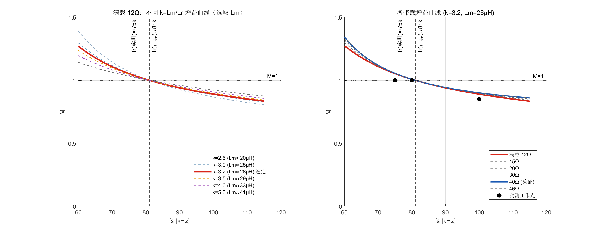

# 60V/300W 缩尺 LLC 样机

**1kW 全桥 LLC 数字控制方案的低压缩尺验证 · 全桥拓扑 · STM32G474 控制 · 以实际到手器件参数为准**

---

## 1. 样机概述

将 1kW 全桥 LLC 数字控制方案缩尺到 **60V/300W**，在 300W/60V 直流电源上完成功率级与控制环路的低压验证。

| 项 | 说明 |
|---|---|
| 拓扑 | 全桥 LLC（原边 ±Vin 方波，4 MOSFET） |
| 增益关系 | Vout = M × Vin（变压器 1:1） |
| 控制 | STM32G474 · HRTIM TimerD REP 中断 · 2p2z 闭环 + 软启动 + 过流保护 |
| 测试电源 | 300W / 60V DC（输入电流以电源屏显为准） |

## 2. 实际器件参数

以到手器件为准。原设计参数（Lr≈7µH、Lm≈24µH、fr≈87.7kHz）与实际到手器件存在偏差，下表及配套脚本均已按实测修正。

| 参数 | 数值 |
|---|---|
| 谐振电感 Lr | **8.2µH** |
| 谐振电容 Cr | **470nF**（CBB） |
| 励磁电感 Lm | **26µH**（励磁比 k = Lm/Lr ≈ 3.2） |
| 谐振频率 fr | **≈75kHz**（实测增益=1；理论计算 ≈81kHz，差 6-8% 属寄生/容差） |
| 特性阻抗 Z0 | ≈ 4.18Ω（√(Lr/Cr)） |
| 变压器 | PQ35 · 1:1 · 6T（原边 6T，副边全绕组 6T = 3T+3T 中心抽头）· 气隙 0.32mm |
| 副边整流 | RHRP860（600V/8A 快恢复）→ 更换为 **MBR10100**（10A/100V 肖特基） |

满载工作点（M=1，fs=fr）：

| 负载 | 功率 |
|---|---|
| 40Ω（两路 20Ω） | ~80W |
| 12Ω（4× 3Ω/100W 串联） | 300W |

变压器绕制规格见 [`PQ3535变压器绕制设计.md`](./PQ3535变压器绕制设计.md)。

## 3. 为什么需要 60V 专用腔（设计基础）

现 1kW 谐振腔按额定 **400V/1kW** 设计（Z0=181.5Ω）。接到 60V 电源上，负载等效阻抗过低、增益封顶 M≈1.0 且无升压区，60V 下跑不出瓦级功率。因此单独设计 60V/300W 专用腔。

设计目标：输入 60V、输出 60V（M=1）、满载 300W、增益曲线平坦有升压裕量、扫频不塌。

FHA 设计要点（`llc_rescale.m` 计算）：

| 参数 | 设计值 | 实际到手 |
|---|---|---|
| Lr | 7µH | **8.2µH** |
| Cr | 470nF | **470nF** |
| Lm | 24µH | **26µH** |
| fr | 87.7kHz（计算） | **≈75kHz（实测增益=1）** |
| Z0 | 3.86Ω | **4.18Ω** |

功率阶梯（M=1，Vout=60V）：**12Ω/300W 满载** · 15Ω/240W · 20Ω/180W · 30Ω/120W · 46Ω/78W。

## 4. 增益曲线

一张图两面板（`llc_rescale.m` 生成）：**左** = 满载 12Ω 下不同励磁比 k=Lm/Lr 增益比对 → 选取 Lm；**右** = 选定 k=3.2（Lm=26µH）后各带载增益曲线（含实测工作点）。

**左面板（选取 Lm）**：满载 12Ω（Q≈0.43）下比较 k=2.5~5.0（Lm≈20~41µH）。增益差异集中在低频升压区，**k=3.2（Lm=26µH，PQ35 气隙 0.32mm）** 在 60~80kHz 区段平坦、有升压裕量（M 略高于 1），且 0.32mm 气隙装配一致性好。k 在 1:1 定增益（调节用）下不是敏感参数，选取装配性最好的 k=3.2。

**右面板（各带载）**：实线为满载 12Ω（Q≈0.43）与验证负载 40Ω（Q≈0.13），虚线为 15/20/30/46Ω。**黑色圆点为实测工作点**（副边整流前方波，40Ω 验证负载）：fr≈75kHz 增益=1、80kHz 满摆 60V、100kHz ≈50V（M≈0.85），落在 40Ω FHA 曲线附近，与实测 fr 低于理论 81kHz 约 6-8%（寄生/容差）一致。

> 注：副边整流前方波增益健康——压降不出在这里，输出压降根因 = 整流管 RHRP860 VF（见 §5）。

原设计参数（Lr=7µH / fr≈87.7kHz）曲线见 [`llc_rescale_60v300w.png`](./llc_rescale_60v300w.png)。

## 5. 工程日志

### 5.1 现象

60V 输入下按输出电压计算，增益/效率低于预期。

### 5.2 排查与排除的假说

对副边整流前（变压器副边）方波增益逐项检查：

| 检查项 | 结论 |
|---|---|
| 谐振腔（Lr/Cr/Lm） | 无异常 |
| 副边方波增益 | **健康**：fr≈75kHz 增益=1；60V 输入 80kHz 满摆 60V（M≈1）、100kHz ≈50V（M≈0.85） |
| 设计 / 器件 | 无异常 |

排查过程中曾怀疑并被实测排除的假说：谐振腔增益曲线封顶（高频/低频掉压）、设计点不匹配、容性硬开关区、死区占空丢失、固定损耗未计入预算——副边增益实测健康，均非压降来源。

### 5.3 定论

副边整流前方波增益健康——不是谐振腔的问题、不是设计的问题、不是器件异常的问题。输出压降全部来自**整流管**。

- 整流管 **RHRP860**（600V/8A 快恢复）正向导通压降 VF 随电流 ~1.0–2.1V/只，全桥整流每半周两只串联，共 **~2–3V**。VF 是随电流变化的曲线，2.1V 为 8A 额定上限，不是固定值。
- 该管按 1kW 高压（400V）系统选取，不能直接用于 60V 缩尺样机。

### 5.4 修复与验证

- 整流管更换为 **MBR10100**（10A/100V TO-220AC 肖特基，单管；非 CT 双管、非 60V 档）：
  - VF ~0.5–0.6V/只，两只串联 ~1.2V，输出恢复 **+2–3V**；
  - 无反向恢复，去除高频开关损耗。
- **验证点：60V / 80kHz / 40Ω → 输出预期 ≈57–58V**（RHRP860 时实测 ≈55–56V）。

### 5.5 关键调试教训

- **输入电流一律以电源屏显为准**，不用万用表 DC 档。
- **低频 95kHz + 轻载曾出现 MOS 发烫 + 40W 输入**（2026-08-10），改在谐振点（fr）验证；后续澄清非容性区硬短路，属大循环电流等其他原因。
- **采样时序修复**：ADC 640 周期 → 12.5 周期（~2.4µs），HRTIM 开关周期边界软件触发、相位锁定无拍频；固件三处 bug（TIMERINDEX 下标、`HRTIM_CR2_SWU` 宏不存在、只写 PER 不写 CMP1 丢 50% 占空比）。
- **采样读数演进与校零方案**（VREFINT 归一化、0V 慢速校零→定死基线、VDDA 漂移、显示侧慢低通抑制 >10Hz 噪声）见 [`01-设计样机/环路设计/README.md`](../01-设计样机/环路设计/README.md) 与 [`03-调试代码/调试日志/`](../03-调试代码/调试日志/)。
- **完整测试方案与早期逐项分析**（含被实测推翻的早期结论，标注齐全）：[`scaled-low-voltage-test-plan.md`](./scaled-low-voltage-test-plan.md)、[`缩尺方案与闭环固件测试报告.docx`](./缩尺方案与闭环固件测试报告.docx)、[`llc_theory.m`](./llc_theory.m)、[`llc_sim.m`](./llc_sim.m)。

## 6. 测试方案与闭环固件

### 6.1 测试准备

- 电源：300W/60V DC，输入电流以电源屏显为准
- 负载：40Ω（两路 20Ω）；满载 12Ω（4× 3Ω/100W 串联）
- 测量：示波器测桥臂中点 Vds、副边方波、输出

### 6.2 上电时序

1. 控制板上电，HRTIM 以最低增益频率（fr 以上）起步，无母线无功率；
2. 合 60V 母线（低压预充，抑制启动浪涌）；
3. 软启动到谐振点，闭合环路。

### 6.3 测试步骤

1. 开环极性验证：固定频率扫频（fr 上下），确认 Vout 随 fs 变化方向正确（fs 越高 Vout 越低）；
2. 谐振点验证：fs = fr ≈75kHz，副边满摆 60V 方波（M=1）；
3. 整流后验证：输出 ≈57–58V（更换 MBR10100 后）；
4. 负载阶跃：切换负载，观察输出回落与恢复；
5. 过流保护：短接输出，确认触发保护并停功率级。

### 6.4 采样与控制（固件）

- 采样：ADC 12.5 周期（~2.4µs），HRTIM 开关周期边界软件触发，相位锁定，无拍频；
- 控制：HRTIM TimerD REP 中断内完成采样 → 状态机（开环/软启动/闭环/故障）→ 2p2z 输出频率；
- 软启动：fr 以上起步，斜坡逼近谐振点，抑制启动浪涌与闭环切入过冲；
- 固件参数切换：60V 低压段 `LC_K_GAIN_SCALE=6.667`、额定 400V 段 `=1.0`；vref、过流阈值按测试目标设定。

## 7. 文件清单

| 文件 | 说明 |
|---|---|
| `README.md` | 本文档：样机概述 / 实际参数 / 设计基础 / 工程日志 / 测试方案与闭环固件 |
| `llc_rescale.m` | 谐振腔参数校核与增益计算（实际到手参数，生成增益曲线图） |
| `llc_theory.m` | FHA 理论 + 无损时域精确解（1kW 现腔接 60V 分析，历史） |
| `llc_sim.m` | 含损耗时域仿真，复现 60V/46Ω 实测（1kW 现腔接 60V，历史） |
| `scaled-low-voltage-test-plan.md` | 60V 缩尺测试方案与闭环固件（含早期作废部分，标注齐全） |
| `缩尺方案与闭环固件测试报告.docx` | 同一报告的 Word 版 |
| `LLC_gain_curves_Lm26uH.png` | 增益曲线一张图两面板：左 = k 比对选取 Lm，右 = 各带载曲线（含实测工作点） |
| `llc_rescale_60v300w.png` | 原设计参数增益曲线（Lr=7µH/fr≈87.7kHz） |
| `PQ3535变压器绕制设计.md` | 变压器绕制规格（1:1、6T、Lm=26µH、气隙 0.32mm） |
