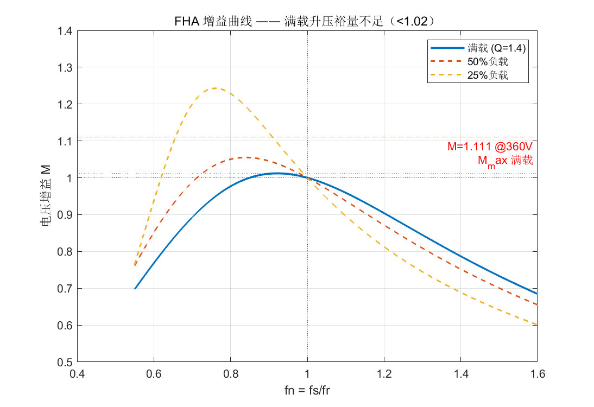
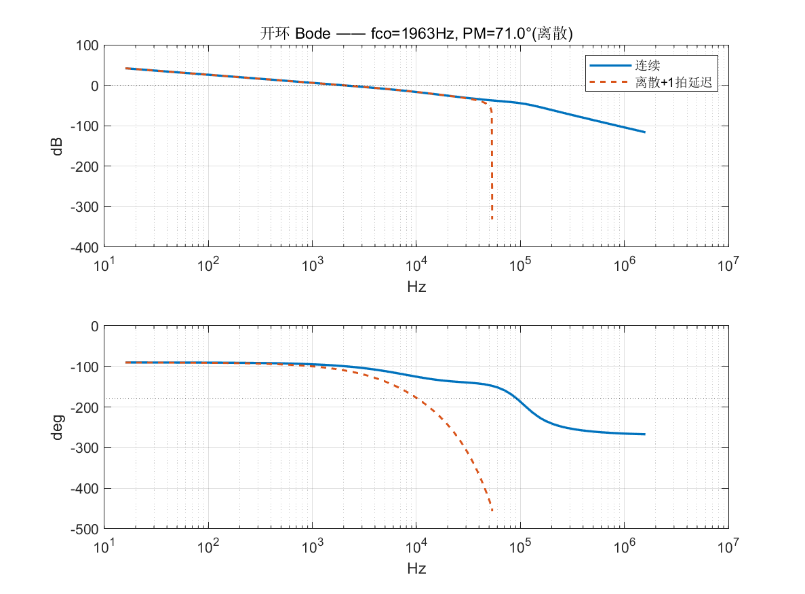
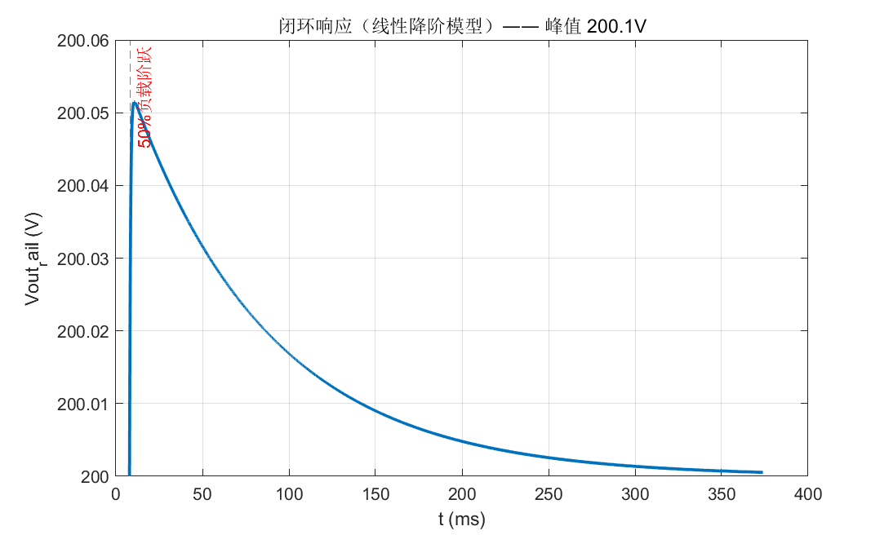
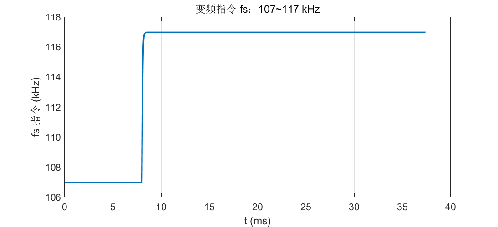

# LLC 数字电压环设计（1kW 样机）

> 配套 MATLAB 脚本：[`llc_loop_design.m`](llc_loop_design.m) — 所有数值均可复现。
> 固件实现：[`voltage-sampling/src/llc_ctrl.{h,c}`](../voltage-sampling/src/llc_ctrl.h)

## 概述

1kW 样机的控制策略是 **PFM（变频）**：全桥恒定 50% 占空比，通过调整开关频率
`fs` 在 95–130kHz 范围内改变谐振腔增益，从而调节输出。本文件按数字电源标准流程
给出设计：**环路建模 → 工作点/增益计算 → 补偿器设计 → 离散化 → 闭环验证**。

```
┌──────┐  全桥LLC    ┌──────────┐  采样链路    ┌──────────┐
│ Vin  ├────────────►│ Vout ±200├────────────►│ STM32G474 │
└──────┘             └──────────┘  AMC1350    └────┬─────┘
        ◄───────────────────────────────────────────┘
         HRTIM TimerD 变频（95~130kHz）
```

- 被控对象：`fs → Vout` 小信号传递函数 `Gvd(s)`
- 补偿器：Type II（积分 + 零点 + 高频极点），Tustin 离散化为 2p2z
- 控制率：每开关周期（Ts = 1/fr ≈ 9.35µs），频率分辨率约 67Hz
- 采样：输出电压幅值平均 `(vp+|vn|)/2`，目标 200V/路

---

## 1. 设计参数

| 参数 | 符号 | 值 | 来源 |
|---|---|---|---|
| 输入电压 | Vin | 360–440V DC | 母线 |
| 输出 | Vout | ±200V / 各 500W | 规格 |
| 变比 | n | **全绕组 1:1**（28T:28T 中心抽头）；每路 28:14=2:1 | 变压器 |
| 谐振电感 | Lr | 270µH（实测 ~275µH） | 外置电感 |
| 谐振电容 | Cr | 8.2nF（实测 ~8.3nF） | 谐振腔 |
| 励磁电感 | Lm | **2mH（实测，设计 1.35mH）** | LCR 表实测，λ=Lr/Lm≈0.135（m≈7.4） |
| 开关频率 | fs | 额定 107kHz，范围 95–130kHz | 设计 |
| 输出电容 | Co | 100µF/路（**待确认**） | 原理图 |
| HRTIM 时钟 | — | 170MHz | CubeMX |

> ⚠️ **两个参数必须在硬件上核实**：`Lm`（决定 K_f 与升压裕量，见 §3/§4）用 LCR
> 表测原边电感；`Co`（决定输出极点位置，见 §5）按实际装料修改。改完重跑
> `llc_loop_design.m`，系数自动更新。

---

## 2. 谐振参数与满载工作点

```
fr = 1/(2π·√(Lr·Cr)) = 107.0 kHz    谐振频率（满载额定工作点）
fm = 1/(2π·√((Lr+Lm)·Cr)) = 43.7 kHz  第二谐振频率（Lm 参与）
Z0 = √(Lr/Cr) = 181.5 Ω              特征阻抗
Rac' = V1rms²/P = 129.7 Ω            反射交流等效电阻
Q  = Z0/Rac' = 1.40                  满载品质因数
```

满载工作点选在 **fs = fr**（谐振点）：此处 ZVS 裕量好、副边电流正弦化程度最高、
整流管近似 ZCS。变频控制以 fr 为中心向两侧展开。

---

## 3. FHA 增益与升压裕量（关键发现）

FHA 电压增益（**标准公式**，与精确 AC 电路传递 `|Zp/(Zseries+Zp)|` 一致）：

```
M(fn,Q,m) = 1 / √( (1+λ−λ/fn²)² + Q²·(fn−1/fn)² )     fn = fs/fr,  λ = Lr/Lm = 1/m
```



**可达最大增益**（受 fs_min=95kHz 限制，即 fn ≥ 0.888）：

| 负载 | Q | 可达 M_max | 最低可保持 ±200V 的输入 |
|---|---|---|---|
| 满载 | 1.40 | **1.011**（峰值 @fn≈0.95，频带内可达） | 396V |
| 50% | 0.70 | 1.041（受 fs_min 限制，理论峰 @fn≈0.75 够不到） | 384V |
| 25% | 0.35 | 1.053（受 fs_min 限制，理论峰 @fn≈0.47 够不到） | 380V |

> **⚠️ 设计发现：满载升压裕量严重不足。**
> 360V 输入需要 M = 400/360 = **1.111**，但满载下谐振腔在频带内最多提供 1.011。
> 意味着**满载、低输入时输出将跌落，无法维持 ±200V**；此时控制器会一路压到
> fs_min 仍不够（甚至低于 fn=0.95 后增益开始回落，压更低反而更差）。应对措施：
> 1. 若必须 360V 满载稳压，需**降 Q**：增大 Lm/Lr 比值（m↑ → M_max↑）或调整
>    Lr/Cr；代价是 ZVS 裕量和轻载效率。
> 2. 控制上：把 fs_min 设到 95kHz，接受低压满载时的输出电压随输入跌落
>    （限功率而非稳压）。注意轻载同样受 fs_min 限制，约 380V 起才会不足。
> 3. 后续可用 PLECS 在满载 + 360V 下验证 M_max，若实测与 FHA 有差（漏感、绕组
>    分布参数），以实测为准。

---

## 4. 静态灵敏度 K_f

K_f = dVout/dfs 是控制器增益的基石。在标准 FHA 公式下，**fn=1 处增益曲线斜率
与负载无关**（`dM/dfn|fn=1 = -2/m`），所以 K_f 恒定：

```
K_f(fs=fr) = (Vin/n) · dM/dfn|fn=1 / fr = (Vin/n) · (-2/m) / fr = -0.748 V/kHz
```

- **与负载无关**（负载只改变输出极点位置，见 §5）——这是早期版本用错误 FHA
  公式得到的"4× 变化"结论的更正，轻载环路实际比满载更稳（§6 裕度表）。
- `m = Lm/Lr` 必须实测：K_f ∝ 1/m，m=4 时 K_f 大 25%（-0.94 V/kHz）。

---

## 5. 小信号被控对象模型

变频 LLC 的小信号模型降阶为三阶（二阶谐振 + 一阶输出）：

```
Gvd(s) = K_f · (1 + s/ωz_lm) / ( (1 + s/ωp_out)·(1 + s/(ωr·Qr) + s²/ωr²) )
```

| 环节 | 频率 | 作用 |
|---|---|---|
| ωz_lm = 2π·fm | 43.7kHz | Lm 谐振零点，远高于穿越频率，可忽略 |
| ωp_out = 2π·19.9Hz | 19.9Hz | **输出极点**：Rload_rail·Co_rail，主导低频极点（满载值） |
| ωr = 2π·fr | 107kHz | 谐振复极点，Qr≈1，对 2kHz 穿越贡献 <15° |

输出极点（满载）：

```
Rload_rail = Vout²/(P/2) = 80 Ω
fp_out = 1/(2π·Rload_rail·Co_rail) = 1/(2π·80·100µ) ≈ 19.9 Hz
```

**fp_out 随负载移动**：`Rload ∝ 1/P ∝ 1/Q`，故 `fp_out(q) = fp_out_full·(q/Q)`。
轻载时 fp_out 左移（50% → 9.95Hz，25% → 4.97Hz），穿越频率随之下移、裕度更好
（见 §6 负载敏感性表）。补偿器零点设在 20Hz 只在满载时精确抵消该极点。

**为什么可以降到三阶**：穿越频率 2kHz 远低于 fr(107kHz)，谐振极点在穿越频率
处只贡献约 12° 相位滞后；设计主要取决于直流增益 K_f 和低频输出极点 fp_out。
这也是把穿越频率取 2kHz（≈ fs/50）的根本原因——对模型不确定性鲁棒。

---

## 6. 补偿器设计（Type II）

补偿器传递函数：

```
C(s) = K_c · (1 + s/ωz) / (s·(1 + s/ωp))
      ωz = 2π·20 Hz     ← 抵消输出极点，提供相位提升
      ωp = 2π·10 kHz    ← 衰减 107kHz 开关纹波
      K_c = -1.6848e7   ← 使 |C·Gvd|@fco = 1（负号编码反相：fs↑→Vout↓）
```

| 指标 | 连续域 | 离散（含 1 拍延迟） |
|---|---|---|
| 穿越频率 fco | 1960 Hz | 1962 Hz |
| 相位裕度 PM | 80.4° | **70.5°** |
| 增益裕度 GM | 43.8 dB | — |

负载敏感性（K_f 恒定，fp_out 左移）：

| 负载 | fp_out | fco | PM | GM |
|---|---|---|---|---|
| 满载 | 19.9 Hz | 1960 Hz | 80.4° | 43.8 dB |
| 50% | 9.95 Hz | 993 Hz | 84.5° | 49.8 dB |
| 25% | 4.97 Hz | 499 Hz | 85.8° | 55.9 dB |

轻载时穿越频率下移、裕度反而增大——**负载越轻环路越稳**，无需为大变化留余量。
开环 Bode：



---

## 7. 离散化（Tustin + 2p2z）

控制率 = **每开关周期**（Ts = 1/fr = 9.349µs，对应 107kHz 中断）。Tustin 变换后
2p2z 差分方程（直接 II 型）：

```
C(z) = (b0 + b1·z⁻¹ + b2·z⁻²) / (1 + a1·z⁻¹ + a2·z⁻²)

w   = b0·e + x1
x1  = b1·e − a1·w + x2
x2  = b2·e − a2·w
fs  = clamp(fr + w, 95k, 130k)
```

| 系数 | 值 |
|---|---|
| b0 | -30456.162712 |
| b1 | -35.760097 |
| b2 | 30420.402615 |
| a1 | -1.54594167 |
| a2 | 0.54594167 |

系数已写进 `voltage-sampling/src/llc_ctrl.h`，由 `llc_loop_design.m` 生成。
离散化引入的 1 拍计算延迟使 PM 从 80.4° 降到 70.5°（±10°），在可接受范围。

> ⚠️ **2026-08 更正**：早期版本（aeb13cf）FHA 公式有误（`1/|1+((fn²-1)/fn)(1/(fn·m·Q)+j)|`
> 偏离精确 AC 电路传递），导致 K_f 低估 40%（-0.535 → -0.748 V/kHz）且误判为随负载
> 4× 变化。本版已统一为标准 FHA 公式，K_c 按 K_f 比例缩放以保持 fco=1960Hz，
> 固件 2p2z 系数已同步更新。M_max 结论不变（满载 396V 为最低输入）。

---

## 8. 闭环仿真验证（线性降阶模型）

`llc_loop_design.m` 第 9 节用离散状态空间传播搭了数字闭环，施加 +10kHz 等效
输入扰动（模拟 50% 负载阶跃）：





- 最大电压偏差 ≈ **72mV**（0.04%），毫秒级恢复（扰动后首个开关周期即回落）
- 频率指令从 107kHz 抬到 ~117kHz（抵消 +10kHz 输入扰动，等效输出跌 -7.5V），
  未撞 130kHz 上限

> ⚠️ 这是**线性小信号验证**（验证模型裕度与系数自洽）。真实的负载阶跃伴随
> 谐振腔大信号、整流管导通切换，必须到 PLECS 里用开关级模型 + 控制器回环验证。
> 见 §10。

---

## 9. 固件集成（STM32G474 HRTIM）

1. **采样**：AMC1350 差分 → 单端调理 → ADC。两路电压读数取幅值平均
   `vmeas = (vp + |vn|)/2`，目标 200V。**采样时间已从 640 周期(60µs) 缩短到
   12.5 周期(~2.4µs)**，并在 HRTIM TimerD REP 周期中断内软件触发（周期边界、
   相位锁定），每开关周期 9.35µs 可闭环（见 §11 与
   [`scaled-low-voltage-test-plan.md`](./scaled-low-voltage-test-plan.md) §5）。
2. **控制率**：在开关周期中断（HRTIM TimerD REP）里调用 `llc_ctrl_period_isr()`
   （每 9.35µs），不是 100ms 轮询。`llc_ctrl_update()` 实现 2p2z。
3. **频率写入**：`llc_apply_frequency(fs)` 把 fs 换算成 HRTIM TimerD 周期寄存器
   并补写 CMP1xR 保 50% 占空比；预装载 + REP 更新事件生效（自带 1 拍延迟）：

   ```
   PER = HRTIM_CLK / fs   →  107kHz: 1588   95kHz: 1789   130kHz: 1307
   HRTIM1->sTimerxRegs[HRTIM_TIMERINDEX_TIMER_D].PERxR  = per;
   HRTIM1->sTimerxRegs[HRTIM_TIMERINDEX_TIMER_D].CMP1xR = (per+1)>>1;
   ```
   ⚠️ 修正了三处旧 `llc_controller.c` bug：`TIMERID`（MCR 掩码）当数组下标会越界、
   `HRTIM_CR2_SWU` 宏不存在、只写 PER 丢 50% 占空比。

4. **保护**：过流 > 3A 锁存（`g_llc_fault`），REP 中断里停止 TimerD 计数与输出。
5. **上电时序**：输出以 130kHz（最低增益）起步 → 2s 窗口合母线 → 软启动
   130k→107k 斜坡 → 切入闭环（见 scaled-low-voltage-test-plan.md §4）。

---

## 10. PLECS 验证步骤（下一步）

1. **对象验证**：按 §5 搭 `Gvd` 传递函数，与开关级模型做 AC 扫描对比
   （增益 K_f、谐振频率、低频极点）——确认模型在 1Hz–10kHz 匹配。
2. **闭环验证**：用 PLECS 控制回路库搭 C(z) 2p2z，做满载↔半载阶跃，
   对比 §8 的响应（预期 PLECS 峰值略大，因包含纹波与非线性）。
3. **极限工况**：满载 + 360V（M_max 不足，验证跌落与保护行为）、空载 + 440V
   （fs 压上限，验证轻载是否进 ZVS 退化区）。
4. **噪声检查**：fs 阶跃分辨率 67Hz → 输出分辨率约 50mV（K_f·Δfs = 0.748×67），
   验证不产生极限环。

---

## 11. 参数敏感性与实测清单

| 参数 | 影响 | 核实方式 |
|---|---|---|
| **Lm** | K_f、M_max、fm | LCR 表测原边电感（100kHz） |
| **Co** | 输出极点 fp_out | 按实际焊盘电容改脚本 |
| **采样时间** | 控制率上限 | ADC 采样须 ≤ 4.5µs（现 60µs，需改） |
| 变比 n（每路） | 增益整体缩放 | 实测匝比（全绕组 1:1，每路 28:14） |
| 整流管压降 | 低压满载时加剧跌落 | 满载 360V 实测 |

改动任何一项：重跑 `llc_loop_design.m` → 更新 `llc_ctrl.h` 系数 →
PLECS 复验。

---

## 文件结构

```
control-loop/
├── README.md                ← 本文件（环路设计）
├── llc_loop_design.m        ← 全部环路设计计算（可复现）
├── llc_theory.m             ← FHA 增益理论曲线 + 时域精确解（回答"低于谐振是否升压"）
├── llc_rescale.m            ← 60V 改腔设计（Z0=52.2，功率阶梯，见 ../docs/工程开发文档.md §3）
├── llc_sim.m                ← 时域仿真 + 损耗灵敏度（复现实测 60V/46Ω 数据）
├── scaled-low-voltage-test-plan.md  ← 缩尺测试方案（⚠️ §3 已作废，见文件顶部更正）
├── tutorial/                ← 交互式 LLC 教学页
└── images/
    ├── fha-gain-curves.png
    ├── loop-bode.png
    ├── closed-loop-step.png
    └── fs-command.png
```

> **2026-08-11 实测修正**：Lm 实测 2mH（λ=0.135）、fr 实测 ~105kHz（设计 107k）、
> 死区实测驱动板 250ns 硬件死区 + HRTIM 59ns（hrtim.c:79-82）→ 全桥占空丢失 ~7-13%。
> 这些参数会改变 K_f 与升压裕量，**改腔/调参前重跑 `llc_theory.m` / `llc_rescale.m`**。
> 60V 缩尺测试的设计点不匹配教训与改腔方案见
> [`../docs/工程开发文档.md`](../docs/工程开发文档.md)。
